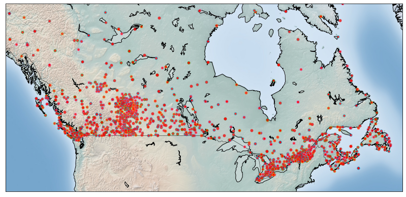
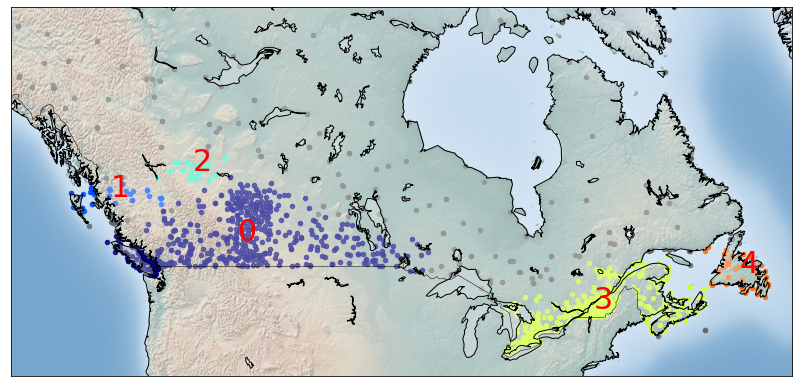
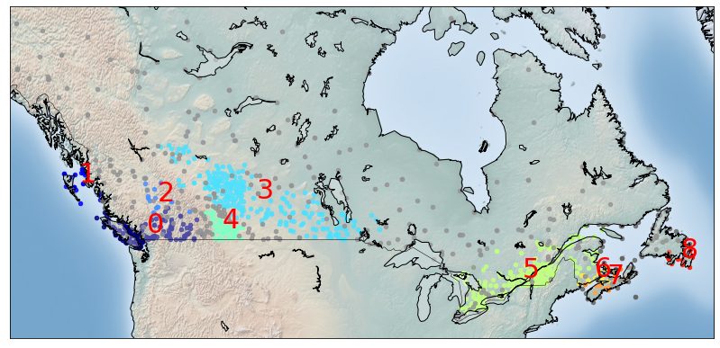

# clustering-weather-stations-in-usa

Using `DBSCAN` clustering algorithm to make clusters of weather stations of USA.

## Table of contents

- [Getting started](#getting-started)
- [Clusters](#clusters)
- [License](#license)

## Getting started

The [notebook](https://www.kaggle.com/akashsdas/clustering-weather-stations-in-usa) is available on Kaggle to work in the same environment where this notebook was created i.e. use the same version packages used, etc...

## Clusters

## License

[APACHE LICENSE, VERSION 2.0](./LICENSE)
